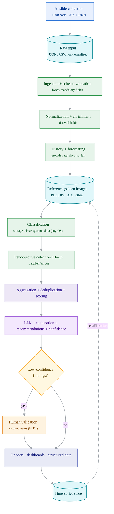
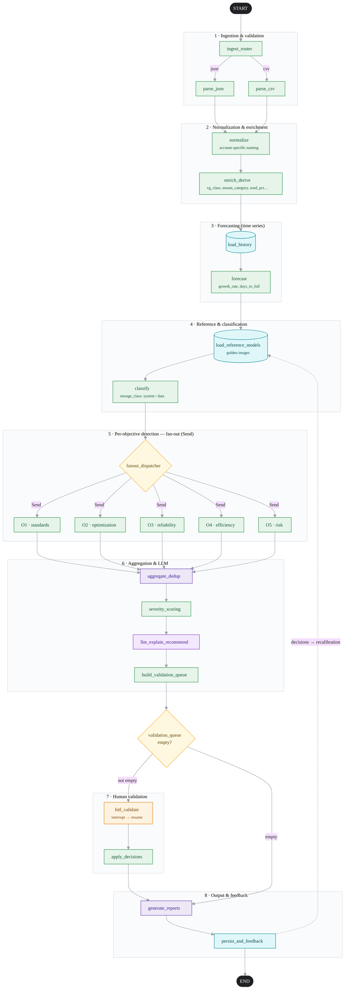
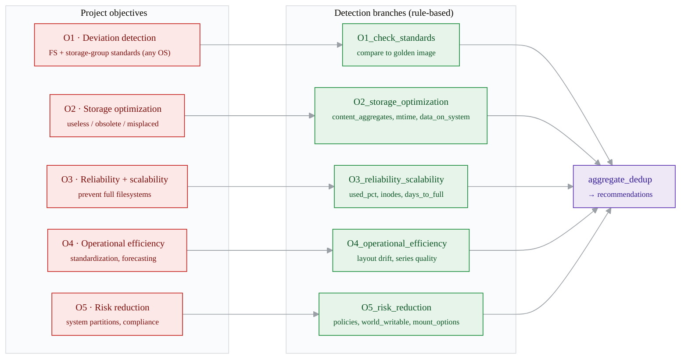
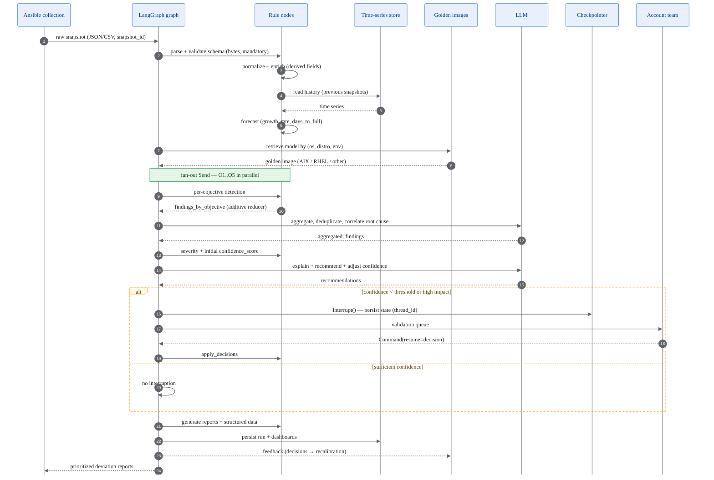
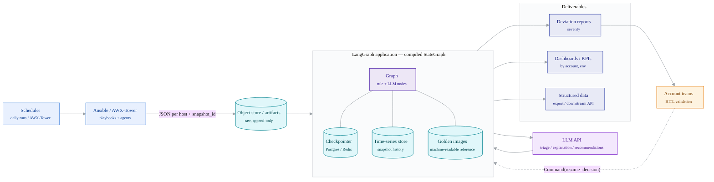

# Architecture LangGraph — pipeline complet

> Conception du systeme agentic, de l'instantane brut collecte par Ansible jusqu'aux rapports de deviation valides.
> **Principe directeur :** les **regles deterministes** mesurent et detectent (aucune hallucination toleree sur un chiffre) ; le **LLM** trie, explique, deduplique et recommande ; un **humain** valide les cas a faible confiance.
>
> **5 diagrammes :** (a) pipeline bout-en-bout · (b) graphe LangGraph detaille · (c) mapping objectifs->branches · (d) sequence d'un run · (e) deploiement / composants. Diagrammes **en anglais**, disponibles en `.mmd`, `.svg`, `.png` (fond blanc) et `.pdf` dans `diagrams/` (+ `architecture-diagrams.pdf` regroupant les 5).
>
> **Mise à jour multi-OS (schéma agnostique).** Le pipeline ingère désormais le **schéma de collecte agnostique v2** (`filesystems[]` + `storage_topology` neutre — voir `docs/data-collection-spec`). La notion `rootvg`/`datavg` est **généralisée** en un champ dérivé **`storage_class` (system / data)** valable AIX, Linux (toutes distros) et **Windows** (tous de plein droit). La normalisation, la classification et le retrieval de référentiel **branchent par `platform`** ; les exemples Python ci-dessous (centrés VG/LV) restent valables pour le sous-cas Unix-LVM.

## Principes d'architecture

Cette architecture est un **graphe d'état LangGraph** (`StateGraph`) déterministe et reproductible, qui transforme un instantané brut de fleet (>=500 hôtes AIX + Linux) en rapports de déviation priorisés et validés. La conception applique une séparation stricte des responsabilités : **les règles font la mesure et la détection déterministe ; le LLM fait le tri, l'explication, la déduplication et la recommandation**.

### 1. Machine à états (state-machine)
Le pipeline est modélisé comme une machine à états dirigée, compilée avec un `checkpointer`. Chaque nœud est une transition pure `State -> partial State`, ce qui garantit la reproductibilité (re-rejouer un `snapshot_id` produit le même résultat tant que les modèles de référence n'ont pas changé). Le flux global suit le `PROCESS STEPS` du cahier des charges : `collect -> normalize -> classify -> compare(golden) -> detect -> prioritize -> recommend -> validate`.

### 2. Frontière Règles vs LLM (décisive)
- **Règles déterministes (code Python pur, pas de LLM)** pour tout ce qui est *mesurable* ou *de conformité stricte* :
  - Normalisation des noms account-specific, calcul des champs DÉRIVÉS (`vg_class`, `mount_category`, `used_percent`, `is_separate_filesystem`, `is_pseudo_fs`, `growth_rate`, `projected_days_to_full`, `system_partition_unexpected_usage_bytes`, `data_present_on_system_flag`).
  - Comparaison au golden image (présence/absence de FS attendu, séparation rootvg/datavg, fstype attendu, options de montage, seuils de remplissage). Ces détections sont **factuelles et auditables** : aucune hallucination tolérée sur « le FS /var est plein à 95 % » ou « datavg n'est pas séparé de rootvg ».
  - Calcul de la `severity` de base par matrice (impact × proximité de saturation × criticité de l'objectif), et du `confidence_score` initial à partir de la complétude des champs obligatoires.
- **LLM (nœuds raisonnement)** uniquement pour ce qui demande du *jugement* :
  - **Triage** : regrouper les déviations corrélées (un VG saturé + N FS pleins = une seule cause racine).
  - **Déduplication sémantique** entre objectifs (la même anomalie remontée par O1 et O5).
  - **Explication** en langage naturel (`recommendation_text`) actionnable et contextualisée OS (AIX vs RHEL).
  - **Ajustement du `confidence_score`** et arbitrage des cas ambigus (naming non reconnu, distro hors référentiel).
  - **Rédaction du rapport** narratif par compte.
  Le LLM ne **crée jamais** un chiffre : il reçoit les faits calculés par les règles et les met en forme. On utilise un **sortie structurée (structured output / JSON schema)** pour contraindre ses réponses.

### 3. Human-in-the-loop (HITL)
Les findings dont `confidence_score < seuil` (ou `validation_status == "needs_review"`, ou déviation à fort impact destructif) sont routés vers une **interruption LangGraph** via la primitive `interrupt()`. Le graphe **persiste l'état complet** dans le checkpointer sous le `thread_id` et attend indéfiniment. L'équipe compte reprend l'exécution avec `Command(resume=<décision>)` ; la reprise repart exactement au nœud interrompu, sans rejouer le pipeline. Cela impose un **checkpointer durable** (Postgres/Redis, jamais `MemorySaver`) car la validation humaine peut dépasser la durée de vie du process.

### 4. Persistance, checkpointer et séries temporelles
- **Checkpointer** (`PostgresSaver`/`RedisSaver`) : durabilité des runs, reprise après interruption HITL, et idempotence (un `snapshot_id` déjà traité n'est pas recalculé).
- **Store historique séparé** (base time-series / table de snapshots) : chaque run écrit `normalized_records` horodatés (`scan_timestamp` UTC). Les nœuds de prévision (`growth_rate`, `projected_days_to_full`) **lisent l'historique** des snapshots précédents du même `host_id`/`path`. La collecte est **répétée dans le temps** (HARD RULE), donc les nœuds de forecasting sont alimentés par retrieval d'historique, pas par l'instantané unique.

### 5. Retrieval des modèles de référence (golden images)
Un nœud charge les **golden images machine-readable** indexés par `(os_family, os_distribution, os_major, host_role_env)` : RHEL 8/9, **AIX** (hd4=/, hd2=/usr, hd9var=/var, hd3=/tmp, hd1=/home, hd10opt=/opt, hd5=boot, hd6=paging, hd8=jfs2log, **datavg séparé de rootvg**), et distros non-RHEL à autoriser. Le retrieval sélectionne le bon modèle par hôte ; l'absence de modèle déclenche un finding « référentiel manquant » plutôt qu'une comparaison hasardeuse.

### 6. Fan-out avec la Send API
La détection est **massivement parallèle**. Après normalisation/classification, un nœud routeur émet un `Send` **par (hôte × objectif)** (ou par batch d'hôtes pour limiter la cardinalité sur 500+ serveurs). Chaque branche objectif s'exécute indépendamment et écrit dans `findings_by_objective` via un **réducteur (reducer) additif** (`Annotated[list, add]`) pour agréger les retours concurrents sans collision.

### 7. Routage conditionnel
`add_conditional_edges` pilote : (a) le format d'entrée (JSON vs CSV) vers le bon parser ; (b) la sélection d'OS (AIX / RHEL / autre) vers la bonne logique de comparaison ; (c) après agrégation, l'aiguillage vers HITL **si** la file de validation est non vide, sinon directement vers la génération de rapport ; (d) la boucle de reprise post-validation.

### 8. Gestion d'erreurs, idempotence et qualité
- **Isolation par nœud** : chaque branche capture ses exceptions dans `errors[]` (avec `host_id`, `node`, `stacktrace`) sans faire échouer le run global (un hôte malformé ne bloque pas les 499 autres).
- **Validation de schéma à l'ingestion** : champs obligatoires manquants -> finding « collecte incomplète » + `confidence` dégradée, pas un crash.
- **Idempotence** : clé `(snapshot_id, golden_image_version)` ; un re-run identique est court-circuité par le checkpointer.
- **Garde-fous LLM** : sortie structurée + re-prompt borné en cas de JSON invalide ; tout finding LLM reste traçable jusqu'au fait-règle source.
- **Sizes en bytes** garantis dès l'ingestion (rejet/normalisation des champs `*_g` arrondis).

## Le State (objet d'état)

```python
from typing import TypedDict, Annotated, Literal, Optional, Any
from operator import add

# --- Sous-structures (typage documentaire) ---

class HostMeta(TypedDict, total=False):
    host_id: str
    hostname: str
    gsma_code: str                 # compte / account
    host_role_env: Literal["prod", "test"]
    os_family: str                 # AIX | Linux
    os_distribution: str           # RHEL | Ubuntu | ...
    os_version: str
    os_major: int                  # DÉRIVÉ
    architecture: Optional[str]
    snapshot_id: str
    scan_timestamp: str            # UTC ISO-8601
    collection_method: str

class NormalizedRecord(TypedDict, total=False):
    host: HostMeta
    # hiérarchie préservée VG -> LV -> FS
    volume_groups: list[dict[str, Any]]      # vg + lv[] + pv[] (sizes en BYTES)
    standalone_filesystems: list[dict[str, Any]]
    paging_swap: list[dict[str, Any]]
    content_aggregates: dict[str, Any]       # child_dir_usage, histogrammes, etc.
    # champs DÉRIVÉS calculés par les règles :
    derived: dict[str, Any]                  # vg_class, mount_category, used_percent,
                                             # is_separate_filesystem, is_pseudo_fs,
                                             # is_network_filesystem, is_readonly,
                                             # device_kind, growth_rate,
                                             # projected_days_to_full, etc.

class ReferenceModel(TypedDict, total=False):
    golden_image_id: str
    key: str                       # (os_family, os_distribution, os_major, env)
    version: str
    expected_filesystems: list[dict[str, Any]]   # path, fstype, separate?, vg_class
    expected_vg_layout: dict[str, Any]           # rootvg/datavg, séparation exigée
    policies: list[dict[str, Any]]               # règles de conformité / seuils

class Finding(TypedDict, total=False):
    finding_id: str
    host_id: str
    objective: Literal["O1_standards", "O2_optimization", "O3_reliability",
                       "O4_efficiency", "O5_risk"]
    target_path: Optional[str]
    deviation_type: str            # DÉRIVÉ (règle)
    evidence: dict[str, Any]       # faits chiffrés (bytes, %, manquant, ...)
    severity: Literal["info", "low", "medium", "high", "critical"]
    confidence_score: float        # 0..1 (règle initiale, ajusté LLM)
    golden_image_id: Optional[str]
    rule_id: str                   # traçabilité de la règle source

class Recommendation(TypedDict, total=False):
    finding_ids: list[str]         # déduplication / regroupement (LLM)
    root_cause: str
    recommendation_text: str       # LLM, actionnable, contextualisé OS
    priority: int
    estimated_impact: dict[str, Any]

class ValidationItem(TypedDict, total=False):
    finding_id: str
    reason: str                    # low_confidence | high_impact | unknown_naming
    proposed: Recommendation
    validation_status: Literal["pending", "approved", "rejected", "amended"]
    reviewer: Optional[str]
    reviewer_comment: Optional[str]

class RunMeta(TypedDict, total=False):
    run_id: str
    thread_id: str
    snapshot_id: str
    input_format: Literal["json", "csv"]
    started_at: str
    golden_image_version: str
    host_count: int
    stats: dict[str, Any]

class PipelineError(TypedDict, total=False):
    host_id: Optional[str]
    node: str
    severity: Literal["warning", "error"]
    message: str
    stacktrace: Optional[str]

# --- LE STATE qui circule dans le graphe ---

class CapacityState(TypedDict, total=False):
    raw_input: Any                                          # JSON ou CSV non normalisé
    meta: RunMeta
    normalized_records: Annotated[list[NormalizedRecord], add]
    reference_models: dict[str, ReferenceModel]            # indexés par key
    classifications: Annotated[list[dict[str, Any]], add]  # vg_class / mount_category par host
    history: dict[str, Any]                                # snapshots antérieurs (forecasting)
    findings_by_objective: Annotated[list[Finding], add]   # fan-out -> reducer additif
    aggregated_findings: list[Finding]                     # dédupliqués / corrélés (LLM)
    recommendations: list[Recommendation]
    validation_queue: Annotated[list[ValidationItem], add] # déclenche HITL
    human_decisions: Annotated[list[ValidationItem], add]  # retours de l'interrupt
    reports: dict[str, Any]                                # par compte + global + structured data
    errors: Annotated[list[PipelineError], add]
```

## Nœuds du graphe

1. **`ingest_router`** — *Règle*. Entrée : `raw_input`, `meta.input_format`. Détecte JSON vs CSV et route via edge conditionnel vers le bon parser. Sortie : `meta`.
2. **`parse_json` / `parse_csv`** — *Règle*. Entrée : `raw_input`. Désérialise, valide le schéma hiérarchique (host -> VG -> LV -> FS + standalone + paging), vérifie les champs OBLIGATOIRES, garantit les tailles en **bytes** (rejette `*_g` arrondis). Erreurs -> `errors[]`. Sortie : enregistrements bruts structurés.
3. **`normalize`** — *Règle*. Entrée : enregistrements parsés. Normalise le **naming account-specific** (gsma_code), unifie devices/paths, produit `*_normalized`. Préserve le **lien FS<->LV<->VG**. Sortie : `normalized_records` (partiel).
4. **`enrich_derive`** — *Règle*. Entrée : `normalized_records`. Calcule TOUS les champs DÉRIVÉS calculables sur l'instantané : `vg_class`, `mount_category`, `used_percent`, `is_separate_filesystem`, `is_pseudo_fs`, `is_network_filesystem`, `is_readonly`, `device_kind`, `os_major`. Sortie : `normalized_records[].derived`.
5. **`load_history`** — *Règle (I/O store)*. Entrée : `host_id`/`path` des records. Lit les snapshots antérieurs depuis le store time-series. Sortie : `history`.
6. **`forecast`** — *Règle*. Entrée : `normalized_records` + `history`. Calcule `growth_rate`, `projected_days_to_full` par régression sur la série temporelle. Sortie : enrichit `derived`.
7. **`load_reference_models`** — *Règle (retrieval)*. Entrée : clés `(os_family, os_distribution, os_major, env)` présentes. Charge les golden images machine-readable (RHEL 8/9, **AIX**, non-RHEL). Modèle absent -> finding « référentiel manquant ». Sortie : `reference_models`.
8. **`classify`** — *Règle*. Entrée : `normalized_records` + `derived`. Confirme rootvg/datavg et system/data par hôte, marque les hôtes hors-référentiel. Sortie : `classifications`.
9. **`fanout_dispatcher`** — *Règle (routeur Send)*. Entrée : `classifications`, `reference_models`. Émet un `Send` par (hôte/batch × objectif) vers les 5 branches. Sortie : (déclenche le fan-out).
10. **`O1_check_standards`** — *Règle*. Compare placement réel vs golden : FS attendus présents, fstype/options/séparation conformes. Produit déviations de standard. Sortie : `findings_by_objective` (reducer).
11. **`O2_storage_optimization`** — *Règle*. Détecte données inutiles/obsolètes/**mal placées** (client sur partition système) via `content_aggregates`, `mtime_age_histogram`, `last_modified_age_days`, `system_partition_unexpected_usage_bytes`, `data_present_on_system_flag`. Sortie : `findings_by_objective`.
12. **`O3_reliability_scalability`** — *Règle*. Détecte risque de saturation : `used_percent` élevé, inodes épuisés, `projected_days_to_full` court, VG sans `vg_free`. Sortie : `findings_by_objective`.
13. **`O4_operational_efficiency`** — *Règle*. Évalue standardisation des structures, écarts de layout récurrents, qualité des données pour forecasting. Sortie : `findings_by_objective`.
14. **`O5_risk_reduction`** — *Règle*. Vérifie conformité policies : seules données appropriées sur partitions système, `world_writable_dir_count`, options de montage risquées. Sortie : `findings_by_objective`.
15. **`aggregate_dedup`** — *Règle + LLM*. Entrée : `findings_by_objective`. Étape règle : fusion exacte par clé `(host, path, deviation_type)`. Étape LLM : **corrélation cause-racine** et **déduplication sémantique** inter-objectifs (sortie structurée). Sortie : `aggregated_findings`.
16. **`severity_scoring`** — *Règle*. Entrée : `aggregated_findings`. Applique la matrice de `severity` et le `confidence_score` initial (complétude + force de la règle). Sortie : findings scorés.
17. **`llm_explain_recommend`** — *LLM*. Entrée : `aggregated_findings` + faits chiffrés + contexte OS. Génère `recommendation_text` actionnable, `root_cause`, priorité ; **ajuste** `confidence_score`. Sortie structurée : `recommendations`.
18. **`build_validation_queue`** — *Règle*. Entrée : `recommendations` + `confidence_score`. Sélectionne `confidence < seuil` ou impact destructif élevé ou naming inconnu. Sortie : `validation_queue`.
19. **`hitl_validate`** — *HITL (interrupt)*. Si `validation_queue` non vide -> `interrupt()` : persiste l'état, attend `Command(resume=...)` de l'équipe compte. Sortie : `human_decisions`, met à jour `validation_status`.
20. **`apply_decisions`** — *Règle*. Entrée : `human_decisions`. Applique approbations/rejets/amendements aux `recommendations` et `aggregated_findings`. Sortie : findings/reco finalisés.
21. **`generate_reports`** — *Règle + LLM*. Entrée : findings/reco validés. Règle : émet **données structurées** (JSON), alimente dashboards et store. LLM : rédige le **narratif par compte** (`gsma_code`) avec sévérité + remédiation. Sortie : `reports`.
22. **`persist_and_feedback`** — *Règle (I/O)*. Entrée : `reports`, findings, décisions. Écrit dans le store time-series (snapshot horodaté) et **réinjecte les décisions humaines** comme jeu d'étiquettes pour le réentraînement/recalibrage des seuils et des golden images. Sortie : confirmations + `meta.stats`.

## Diagrammes d'architecture

### (a) Pipeline end-to-end (haut niveau)



### (b) Graphe LangGraph détaillé (edges conditionnels, Send, interrupt, feedback)



### (c) Mapping objectifs -> branches



### (d) sequenceDiagram d'un run



### (e) Deploiement / composants



