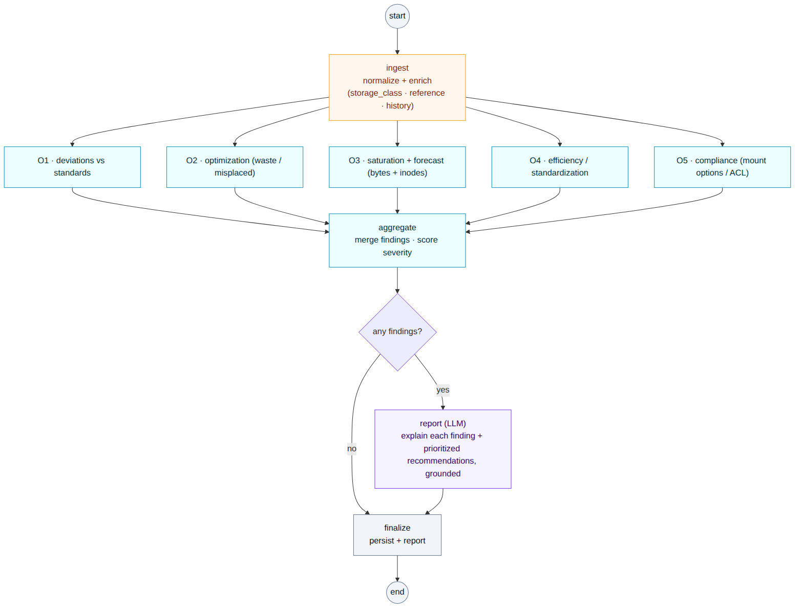

# LangGraph graph (LLM layer)

How the agentic layer is structured as a LangGraph graph. One graph, run once per host, fully automated end to end, with no human step inside the pipeline.

The shape: one **ingest** node processes the input (normalize and enrich), then one **processing node per objective** (O1 to O5) runs in parallel, their findings are **aggregated**, and a single **LLM** node turns the findings into explanations and prioritized recommendations. Rules do all the detection; the LLM only explains and recommends; recommendations are advisory output read downstream.



## State

```python
from typing import Annotated, TypedDict
import operator

class State(TypedDict):
    host: dict                                     # input: one collected host snapshot (validated)
    enriched: dict                                 # ingest output: normalized and enriched
    findings: Annotated[list[dict], operator.add]  # objective nodes append; merged automatically
    report: dict | None                            # LLM: explanations and prioritized recommendations
```

`findings` uses a reducer (`operator.add`) so the parallel objective nodes can each append without overwriting one another.

## Nodes

| Node | Type | Does |
|---|---|---|
| `ingest` | pre | Normalize the host snapshot and enrich it (derive `storage_class` / `mount_category`, attach the matched reference standard and the prior-snapshot history) so each objective node is self-contained. |
| `o1_deviations` | rules | Layout, size, and fstype deviations vs the reference standard (O1). |
| `o2_optimization` | rules | Useless, obsolete, or misplaced data, and over-provisioning (O2). |
| `o3_saturation` | rules | Saturation and forecast, in bytes and inodes (O3). |
| `o4_efficiency` | rules | Structure standardization and capacity efficiency (O4). |
| `o5_compliance` | rules | Mount-option, ACL, and world-writable compliance (O5). |
| `aggregate` | rules | Merge the per-objective findings and score severity. |
| `report` | LLM | Explain each finding in plain language and produce prioritized, grounded recommendations (each cites a finding). |
| `finalize` | (I/O) | Persist findings and report. |

## Routing

- After `ingest`, the five objective nodes **run in parallel** and fan back into `aggregate`. Adding or changing an objective is just adding or removing a node; nothing else moves.
- The **LLM runs once, on the merged findings**, and is **skipped entirely when there are no findings** (a clean host costs zero tokens).
- There is **no human-in-the-loop node**. The graph never pauses for a person; people read the reports and act on them outside the graph. The checkpointer is used only for crash-safe resume and retries.

## Wiring

```python
from langgraph.graph import StateGraph, END

OBJECTIVES = ["o1_deviations", "o2_optimization", "o3_saturation", "o4_efficiency", "o5_compliance"]

g = StateGraph(State)
g.add_node("ingest", ingest)
for name in OBJECTIVES:
    g.add_node(name, make_objective_node(name))   # rules only
g.add_node("aggregate", aggregate)
g.add_node("report", report)                      # LLM
g.add_node("finalize", finalize)

g.set_entry_point("ingest")
for name in OBJECTIVES:
    g.add_edge("ingest", name)        # fan-out: objective nodes run in parallel
    g.add_edge(name, "aggregate")     # fan-in
g.add_conditional_edges("aggregate", lambda s: "report" if s["findings"] else "finalize")
g.add_edge("report", "finalize")
g.add_edge("finalize", END)

app = g.compile(checkpointer=checkpointer)   # crash-safe resume / retries only
```
